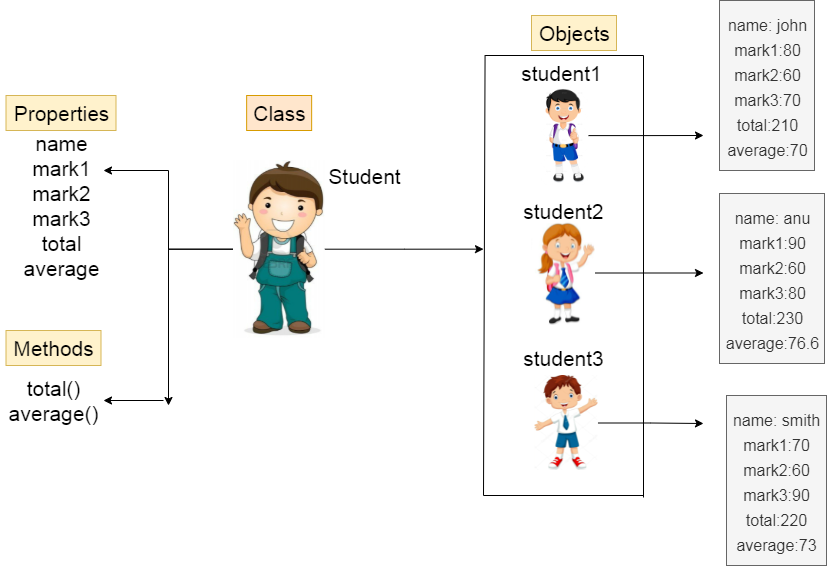

## Classes

- Class 
  - Representa a estrutura que compõe a criação de objetos de mesmo tipo.
  
- Identity 
  - Propósito existencial aos objetos que serão criados, trazendo mais sentido para os objetos tornando mais entendível.

- States
  - Representa o estado dos nossos objetos, as tais **propriedades** ou **atributos** como chamamos.

- Behavior
  - Define as **ações** ou **métodos**, ou seja toda parte comportamental desse tal objeto.

- Instanciar 
  - É o ato de criar o objeto definido a partir da estrutura que foi definida na class.

## Exemplo Estudante 



```java
public class Student {
  String name;
  int age;
  Color color;
  Sex sex;

  void eating(Food food){
    // Nosso código
  } 
  void drinking(Drink drink){
    // Nosso código
  }
  void running(){
    // Nosso código
  }
}
```

## Exemplo Escola

```java
public class School {
  public static void main(String[] args) throws Exception {
    Student student1 = new Student();
    student1.name = "Kaique";
    student1.age = 18;
    student1.color = Color.FAIR;
    student1.sex = Sex.MALE;
  }
}
```

### Tipos de classes

- Classe de modelo (model)
  - São as classes que representam uma estrutura de domínio da aplicação, Exemplo: Cliente, Pedido, Nota Fiscal, etc.

- Classe de serviço (service)
  - Classes que possui regras de negócio e validação de nosso sistema.

- Classe de repositório (repository)
  - Classes que possui integração com o BD.

- Classe de controle (controller)
  - Classe específica para lidar com comunicações externas, por exemplo uma http web ou webservices.

- Classe utilitárias (util)
  - Classe responsável por trazer recursos comuns da nossa aplicação

