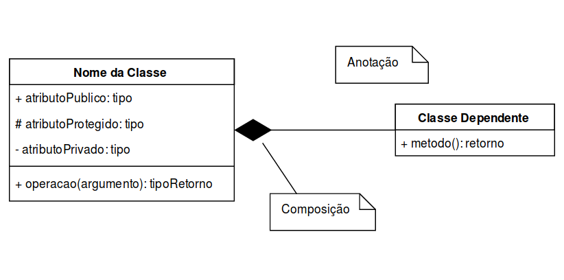
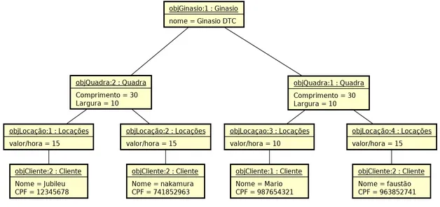
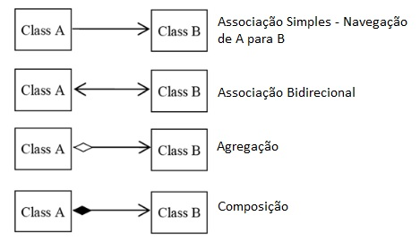
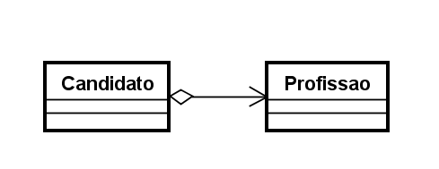
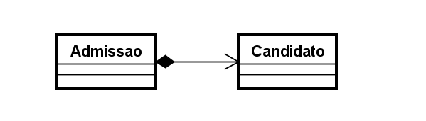
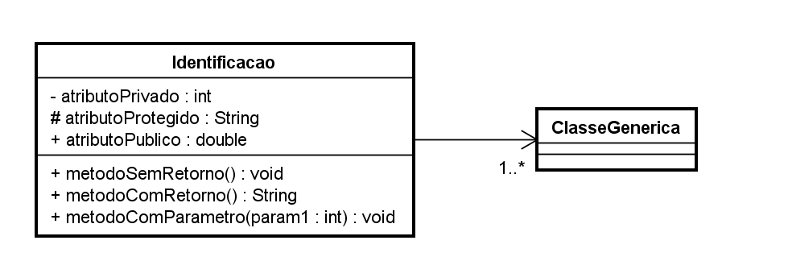
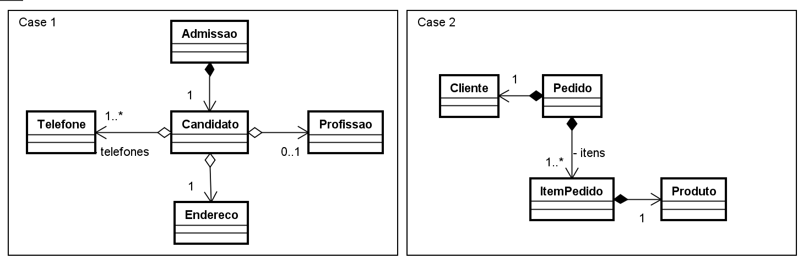

# UML

**Linguagem de Modelagem Unificada**.

É uma notação que possibilita a estrutura gráfica do nosso projeto.

## Conceitos

Existem 3 conceitos na UML, eles são:

- **diagramas**
- **elementos**
- **relacionamentos**

Notações UML são dividas em 2 categorias: **estruturais** e **comportamentais**.

## Diagramas estruturais 

- **Diagrama de classe** 
  - Ele é utilizado para fazer a representação de estruturas de classes de negócio, interface e outros componentes do sistema. É considerado um dos mais importantes.

- **Diagrama de objetos**
  - Representa os objetos existentes em um determinado instante ou fato da nossa aplicação.

### Diagrama de Classe

Será representado **graficamente** como as classes serão estruturadas e interligadas na nossa aplicação. Visando as seguintes características: 

- **Identificação:** Nome e/ou finalidade da classe

- **Atributos:** Propriedades e/ou características

- **Operações:** Ações e/ou métodos

##### Relacionamentos 

Classes podem existir de forma independente, mas haverá, em alguma etapa da aplicação a necessidade de algumas se relacionarem, devemos compreender o nível de depedência entre elas:

###### **Associação** 

Define o relacionamento de uma classe com outra, por exemplo: Uma escola terá um relacionamentos com alunos, um carro tem relação com as rodas, e assim por sucessivamente.

Entre os tipos existem:

 

- **Associação simples** 
  - Um cliente tem uma profissão, uma escola tem alunos...
- **Associação Bidirecional**
  - Quando duas classes precisam se enxergar

#### Agregação

A classe principal contém uma relação com outra classe, mas ela pode existir, sem a classe agregadora. Por exemplo um cadastro de Candidatos, podemos encontrar candidatos que ainda não possuam uma profissão.

#### Composição 
 
A composição já caracteriza uma dependência existencial, entre a classe principal e a classe associada. Por exempo uma admissão só poderá ocorrer, contendo suas informações básicas e a composição do candidato selecionado.

###### **Multiplicidade**

Nem sempre o relacionamento entre as classes, será de **um para um**, em um determinado cenário poderá exigir multiplicidades específicas, conforme opções abaixo:

- 1. -> Representa uma associação, contendo um elemento;
- *. -> Representa uma associação, contendo uma lista de elementos;
- 0..1 -> Representa uma associação, contendo zero ou um elemento;
- 0..* -> Representa uma associação, contendo zero ou uma lista de elementos;
- 1..* -> Representa uma associação. contendo um ou uma lista de elementos.

###### **Visibilidade**

Os atributos e métodos de uma classe, podem receber níveis de visibilidade, e na UML existem símbolos que representam cada um deles.

- (+) Visibilidade pública;
- (#) Visibilidade protegida (muito associada com herança);
- (-) Visibilidade privada.

# Vamos Praticar 

