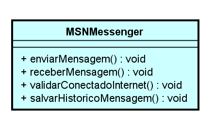

# Pilares do POO

Paradigma de programação baseado no conceito de objetos

## Encapsulamento

"Nem tudo que eu faço todos precisam saber..."

O encapsulamento está interligado com visibilidade de recursos. Por exemplo: Na engenharia para que um veículo funcione existem muitos processos. Já para o condutor ele simplesmente liga a ignição e o carro "magicamente" funciona.

## Herança

Características e comportamentos comuns podem ser compartilhados através da hierarquia de objetos. Como no caso, que eu crio uma classe Veiculo que irá disponibilizar atributos como placa, chassi, ano de fabricação. Métodos como acelerar e frear, serão herdados para moto e carro, para evitar uma codificação redundante.

## Abstração

Em certos momentos não precisamos entender totalmente a lógica de algo para depois executá-lo, para que possamos ligar um carro não precisamos necessariamente saber os processos envolvidos para que esse veículo funcione, apenas precisamos saber o resultado disso, no caso de uma função precisamos apenas entender qual vai ser o seu retorno.

## Polimorfismo

Inumeras maneiras de realizar uma mesma ação.

### Exemplos

Exemplo de polimorfismo/herança/encapsulamento: 

- Ligando carro

```java
public class Carro extends Veiculo {
	public void ligar() {
		confereCombustivel();
		confereCambio();
		System.out.println("CARRO LIGADO");
	}
	private void confereCombustivel() {
		System.out.println("Conferindo combustivel...");
	}
	private void confereCambio() {
		System.out.println("Conferindo se cambio esta no P...");
	}
}
```

- Ligando moto

```java
public class Moto extends Veiculo {
	public void ligar() {
		System.out.println("MOTO LIGADA");
	}
}
```

A interligação por herança nesses exemplos pode-se observar no `... extends Veiculo ...`, basicamente esse objeto irá herdar os atributos do Veiculo:

```java
public abstract class Veiculo {
	private String chassi;
	
	public String getChassi() {
		return chassi;
	}
	public void setChassi(String chassi) {
		this.chassi = chassi;
	}
	public abstract void ligar();
}
```

O objeto Veiculo possui um tipo abstrato, onde diz que esse Veiculo possui métodos abstratos, ou seja que seus métodos não possuem a mesma lógica de execução porém a ação é um padrão de cada aspecto. Como é o caso do método ligar() que é definido como uma função abstrata.

# Prática



```java
public class MSNMessenger {
	public void enviarMensagem() {
		System.out.println("Enviando mensagem");
	}
	public void receberMensagem() {
		System.out.println("Recebendo mensagem");
	}
	public void validarConectadoInternet() {
		System.out.println("Validando se está conectado a internet");
	}
	public void salvarHistoricoMensagem() {
		System.out.println("Salvando o histórico da mensagem");
	}
}
```

#### Pontos de atenção:

- Todos os métodos da classe são public (tudo realmente precisa estar visível ?);
- Só existe uma única forma de se comunicar via internet (como ter novas formas de se comunicar mantendo a proposta central ?).
